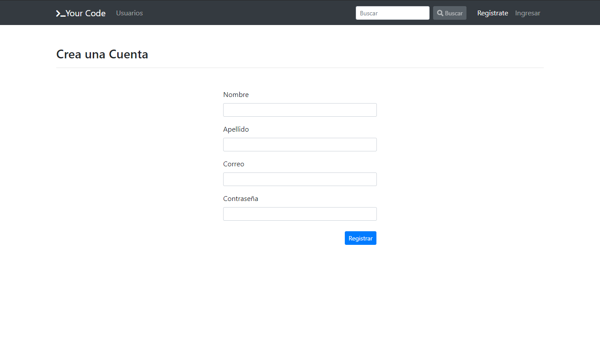
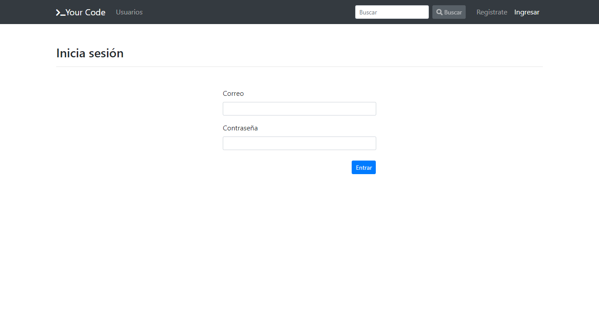
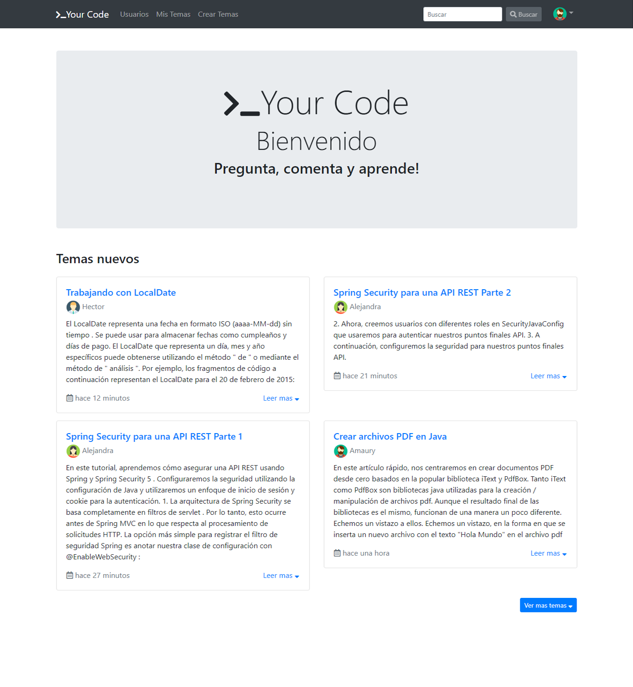
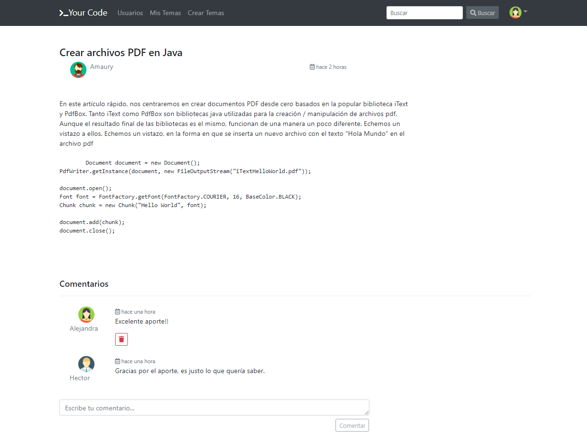
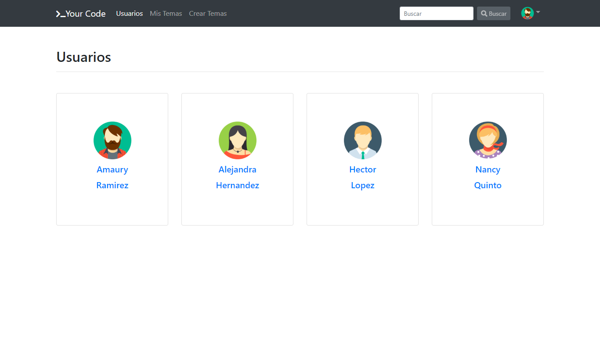
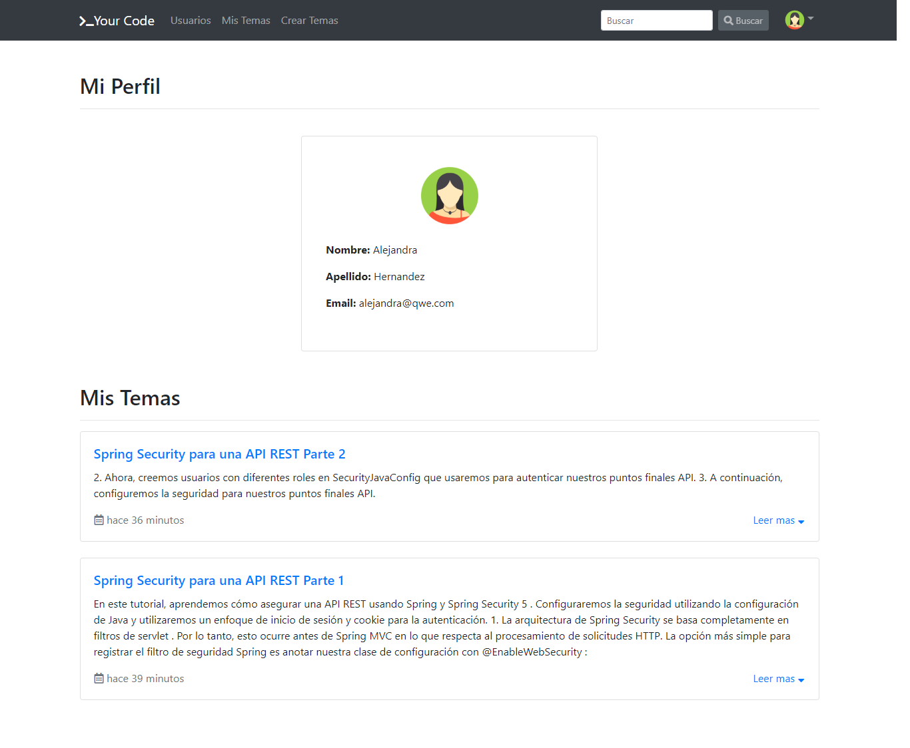
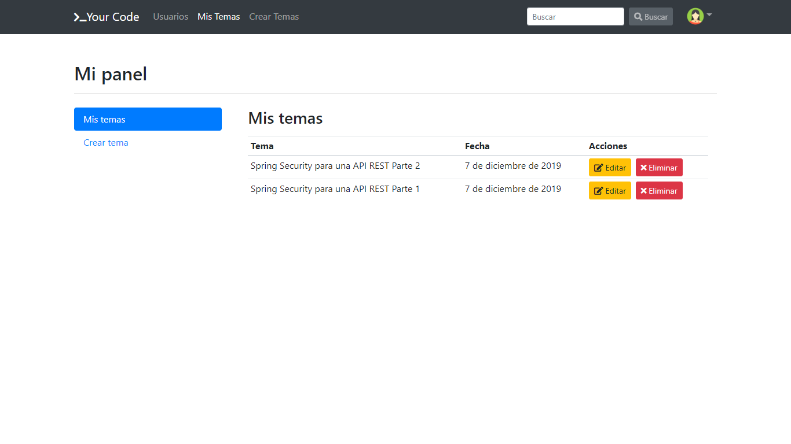

# Foro NodeJs & Angular 

## Backend

### API REST
| METHOD | END POINT                                    | COMMMENT                             |
| :----- | :------------------------------------------- | :----------------------------------- |
| POST   | /api/v1/users                                | Agregar usuario                      |
| GET    | /api/v1/users?page={page}                    | Página de lista de usuarios          |
| GET    | /api/v1/users/{id}                           | Obtener usuario por id               |
| PUT    | /api/v1/users                                | Actualizar usuario                   |
| DELETE | /api/v1/users                                | Eliminar usuario                     |
| POST   | /api/v1/users/token                          | Obtener token                        |
| POST   | /api/v1/users/avatar                         | Agregar imagen a usuario             |
| GET    | /api/v1/users/avatar/:fileName               | Obtener imagen de usuario            |
| POST   | /api/v1/topics                               | Agregar un tópico                    |
| POST   | /api/v1/topics/search                        | Lista de tópicos filtrados           |
| POST   | /api/v1/topics/search-paginated/:page        | Página de lista de tópicos filtrados |
| GET    | /api/v1/topics/:page?                        | Página de lista de tópicos           |
| GET    | /api/v1/topics/topic/{id}                    | Obtener tópico por id                |
| GET    | /api/v1/topics/user-topics/:user?page={page} | Obtener tópico por id                |
| PUT    | /api/v1/topics/{id}                          | Actualizar tópico                    |
| DELETE | /api/v1/topics/{id}                          | Eliminar tópico                      |

## Frontend

